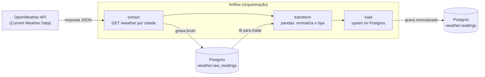

# 🌦️ Airflow OpenWeather ETL (Home Lab de Dados)

Home lab de dados focado em **consumo de API**: um pipeline ETL batch que extrai dados
meteorológicos da [OpenWeather API](https://openweathermap.org/api), transforma com
**pandas** e carrega em **PostgreSQL**, tudo orquestrado pelo **Apache Airflow** e
conteinerizado com **Docker Compose**.

Diferente dos outros dois home labs desta série (que exploram processamento distribuído
com Spark e streaming com Kafka), o objetivo aqui é outro: dominar o ciclo básico e mais
comum de um pipeline de dados — **extrair de uma API REST externa, tratar com pandas e
persistir em um banco relacional** — com boas práticas de idempotência, agendamento e
tratamento de erros dentro do Airflow.

---

## A ideia

- **Extract** — uma task Python chama a API do OpenWeather (endpoint *Current Weather
  Data*) para uma lista de cidades configurável e guarda a resposta bruta (JSON).
- **Transform** — pandas normaliza os campos (temperatura, umidade, pressão, vento,
  descrição do clima), converte unidades/timestamps e trata duplicidades.
- **Load** — os dados tratados são gravados no PostgreSQL via `INSERT`/`UPSERT`,
  particionados por cidade e timestamp de coleta.
- **Orquestração** — uma DAG do Airflow roda em intervalos regulares (ex.: `@hourly`),
  com `catchup` desligado e re-tentativas configuradas para lidar com instabilidade da
  API externa (rate limit, timeout).

---

## Arquitetura



### Serviços (containers)

| Serviço | Papel | Porta(s) |
|---|---|---|
| `airflow-webserver` / `airflow-scheduler` | Orquestração da DAG (LocalExecutor — sem necessidade de Celery/Redis, já que não há processamento distribuído) | 8080 (UI) |
| `postgres_airflow` | Metadados do Airflow | — |
| `postgres_weather` | Dados brutos e tratados da API (camadas `raw_readings` e `readings`) | 5432 |

> Stack intencionalmente mais leve que os outros home labs: sem Spark (não há volume de
> dados que justifique processamento distribuído) e sem MinIO (o dado final é
> estruturado e cabe bem em um banco relacional).

---

## Modelo de dados

Cada leitura de clima coletada da API é normalizada para os seguintes campos:

| Campo | Descrição |
|---|---|
| `city` / `country` | Cidade e país consultados |
| `lat` / `lon` | Coordenadas geográficas |
| `collected_at` | Timestamp UTC da coleta (chave de deduplicação junto com `city`) |
| `temp` / `feels_like` / `temp_min` / `temp_max` | Temperaturas (°C) |
| `pressure` / `humidity` | Pressão (hPa) e umidade (%) |
| `wind_speed` / `wind_deg` | Velocidade (m/s) e direção do vento |
| `clouds` | Cobertura de nuvens (%) |
| `weather_main` / `weather_description` | Condição climática (ex.: `Rain`, "chuva leve") |
| `sunrise` / `sunset` | Horários do nascer/pôr do sol (UTC) |

---

## Estrutura (planejada)

```
.
├── dags/                # DAGs do Airflow (extract → transform → load)
│   └── sql/             # DDL das tabelas raw_readings / readings
├── etl/                 # Módulos Python (client da API, transformações pandas)
├── docker/              # Dockerfile do Airflow + docker-compose.yml
├── .env.example         # Template de variáveis de ambiente (API key, credenciais)
└── tests/               # Testes das transformações
```

---

## Stack

`Apache Airflow` · `Python` · `pandas` · `PostgreSQL` · `Docker Compose` · `OpenWeather API`
